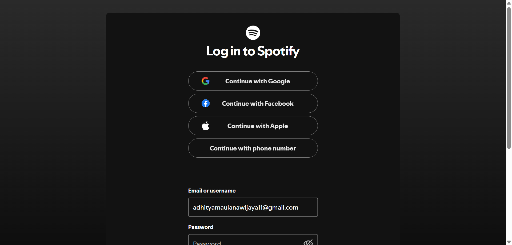
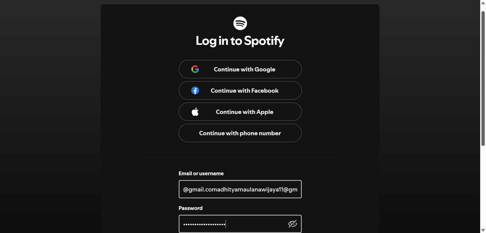
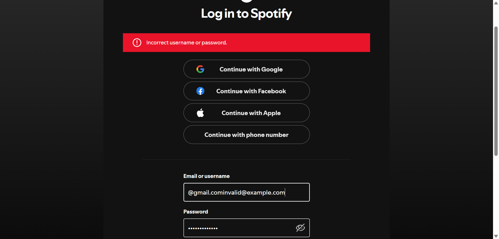
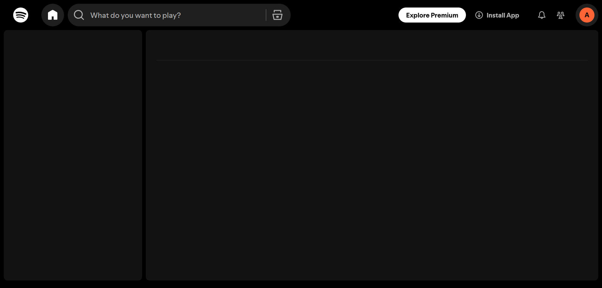
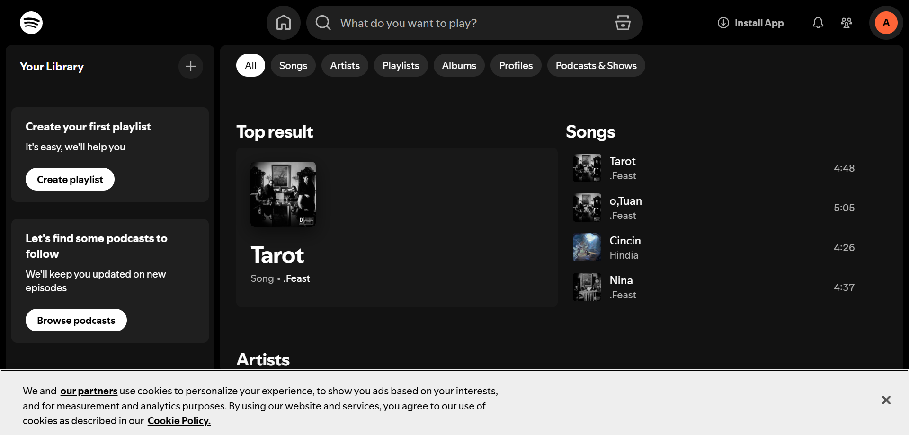

# 🎵 Spotify Web GUI Automation Testing

End-to-end automation testing project for **Spotify Web Player** using **Selenium WebDriver** and **Node.js**.

This project simulates real user interactions including login validation, negative testing, authenticated homepage verification, and music search functionality.

---

## 🚀 Tech Stack

- Node.js
- Selenium WebDriver
- ChromeDriver
- dotenv
- chalk (CLI reporter)

---

## 📂 Project Structure

```

SPOTIFY-WEB-GUI-TESTING/
│
├── tests/
│ ├── 1_loginPageLoad.js
│ ├── 2_fillLoginForm.js
│ ├── 3_invalidLoginForm.js
│ ├── 4_homePageCheck.js
│ └── 5_searchSong.js
│
├── docs/
│ ├── login-password-form.png
│ ├── fill-form-success.png
│ ├── invalid-login-success.png
│ ├── homepage-success.png
│ └── search-success.png
│
├── driver.js
├── index.js
├── .env
├── package.json
└── README.md

```

---

## 🧪 Test Scenarios

### 1️⃣ Login Page Load Test

- Opens Spotify login page
- Inputs email from environment variable
- Validates password form visibility
- Captures screenshot

📸


---

### 2️⃣ Valid Login Form Interaction

- Inputs valid credentials
- Verifies field interaction
- Captures success state

📸


---

### 3️⃣ Invalid Login Test (Negative Testing)

- Inputs incorrect credentials
- Validates error message display
- Confirms proper failure handling

📸


---

### 4️⃣ Homepage Authentication Check

- Injects authentication cookies
- Verifies homepage loads successfully
- Confirms Search and Home buttons are visible

📸


---

### 5️⃣ Search Song Test

- Navigates directly to search URL
- Searches for specific keyword
- Validates track results are displayed

📸


---

## 🔐 Environment Configuration

Create a `.env` file in the root directory:

```

SPOTIFY_EMAIL=your_email_here
SPOTIFY_PASSWORD=your_password_here

```

⚠️ The `.env` file is excluded via `.gitignore` for security reasons.

---

## 🛠 Installation

1. Clone the repository
2. Install dependencies:

```bash
npm install
```

Make sure:

- Google Chrome is installed
- ChromeDriver version matches your Chrome version

---

## ▶ Running Test Suite

Run all tests sequentially:

```bash
node index.js
```

The CLI will display:

- Real-time test execution
- Duration per test
- Pass / Fail summary
- Exit status for CI integration

Example output:

```
🚀 Starting Spotify GUI Test Suite...

🟢 Passed: 5
🔴 Failed: 0
⏱️ Total Duration: 18.32s

✅ All tests passed successfully.
```

---

## 📊 Test Runner Features

The custom test runner (`index.js`) provides:

- Sequential test execution
- Colored terminal output
- Execution time tracking
- Pass/Fail statistics
- CI-friendly exit codes

---

## 🔎 Screenshot Artifacts

All test screenshots are stored inside:

```
/docs
```

These screenshots serve as visual execution evidence.

---

## ⚠ Security & Privacy Notice

- Real credentials are stored securely in `.env`
- Session cookies shown in this repository are placeholders
- No sensitive information is committed

---

## 🎯 Project Goals

This project demonstrates:

- End-to-end GUI automation
- Login flow validation
- Negative testing implementation
- DOM synchronization handling
- Asynchronous test orchestration
- CLI-based reporting
- Secure environment configuration

---

## 👨‍💻 Author

Developed by **Adhitya Maulana Wijaya** | GitHub: https://github.com/AdhityaMaulana11 | LinkedIn: https://www.linkedin.com/in/adhitya-maulana-wijaya-b11534292/

---

## 📌 Disclaimer

This project is created for automation testing practice and educational purposes only.
Spotify is a registered trademark of its respective owner.
